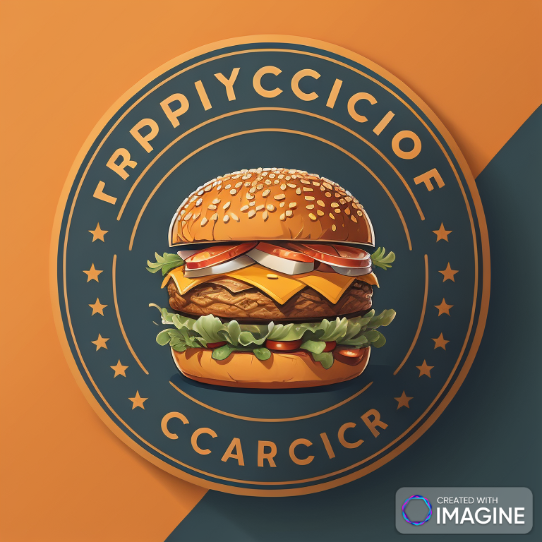
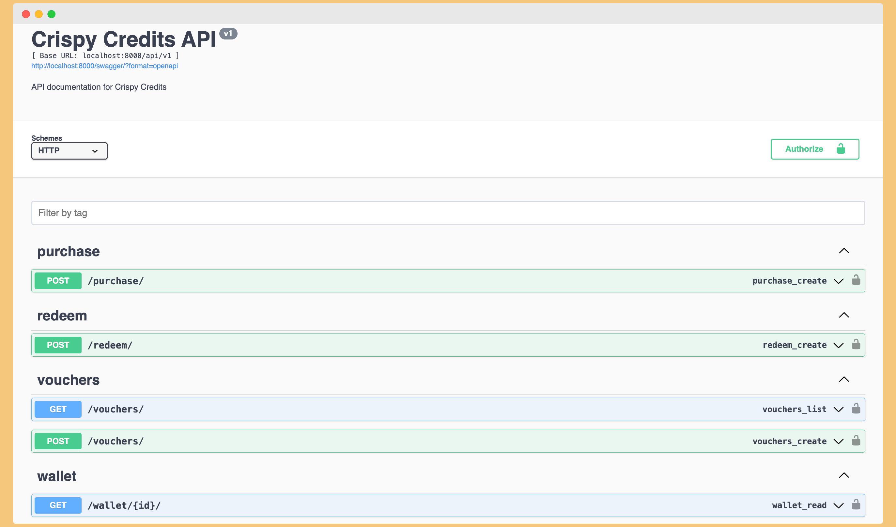
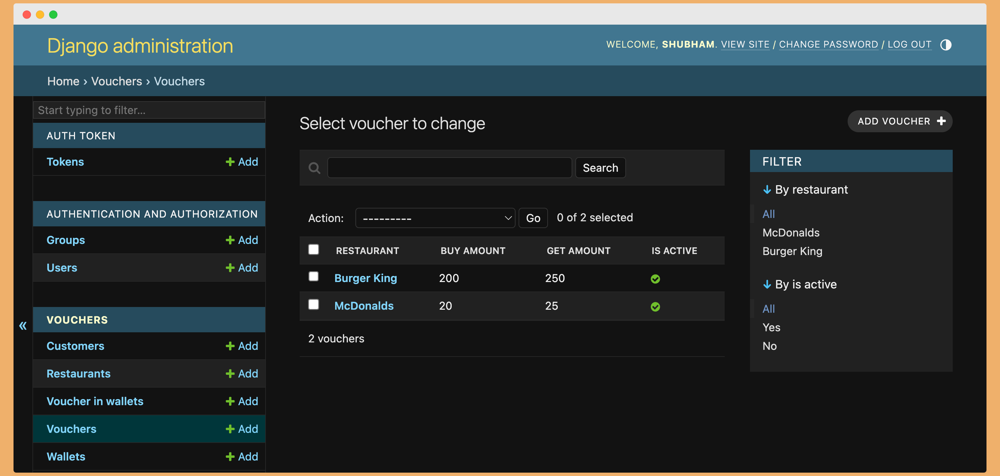
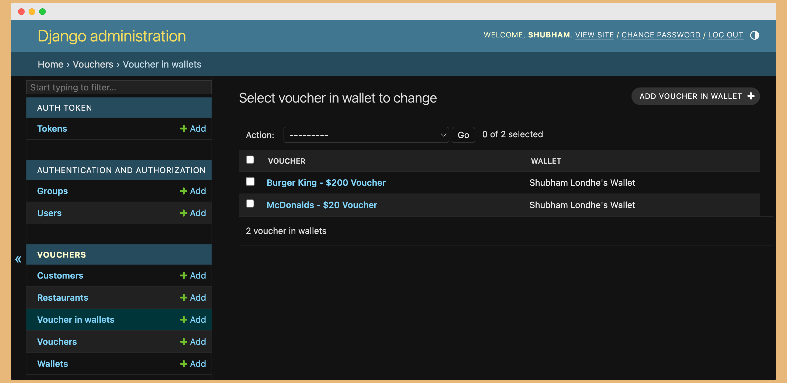
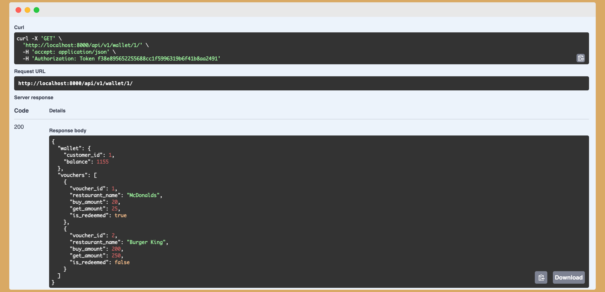

[![MIT License][license-shield]][license-url]

[![LinkedIn][linkedin-shield]][linkedin-url]

  
  
  

<!-- PROJECT LOGO -->

<br  />

<p  align="center">

<a  href="https://ibb.co/sC0TMQV">



</a>

  
  
  


<p  align="center">

# Crispy Credits - Because Who Doesn't Love a Little Extra Crunch and Credit Vouchers?
<br  />

<br  />

<a  href="https://github.com/LondheShubham153/">Report Bug</a>


<a  href="https://github.com/LondheShubham153/">Request Feature</a>

</p>

  
  
  

<h3  align="center"> Built With </h3>

  

<p  align="center">


  

</p>

</p>

  
  
  

<!-- TABLE OF CONTENTS -->

## Table of Contents

  

* [About the Project](#about-the-project)

* [Getting Started](#getting-started)

* [Prerequisites](#prerequisites)

* [Installation](#installation)

* [Docker](#docker)

* [Usage](#usage)

* [Roadmap](#roadmap)

* [Contributing](#contributing)

* [License](#license)

* [Contact](#contact)

  
  
  

<!-- ABOUT THE PROJECT -->

## About The Project

  

<table>

<tr>

<td  align="center">



<br>

Product Screenshot 1

</td>

<td  align="center">



<br>

Product Screenshot 2

</td>

</tr>

<tr>

<td  align="center">



<br>

Product Screenshot 3

</td>

<td  align="center">



<br>

Product Screenshot 4


</table>

  
  


Welcome to Crispy Credits, the app that's turning vouchers into a delicious experience! 🍟

## What's the Crunch?

Crispy Credits is your go-to place for creating, munching on, and savoring vouchers that add a sprinkle of joy to your dining adventures. It's not just an app; it's a crispy journey filled with delightful surprises!

## Features That Make You Go "Mmm":

-   **Crispy Voucher Creation:** Restaurants, get ready to fry up some tempting vouchers with mouthwatering buy and get amounts!
-   **Munch-Worthy Voucher Purchase:** Customers, indulge in the joy of purchasing vouchers at a discount. Your wallet will thank you!
-   **Redeem with Flavor:** Use your crispy vouchers to pay for meals. Whether it's a full feast or a light snack, we've got you covered.
-   **Wallet Goodness:** Your Crispy Credits don't just disappear – they're stored safely in your wallet for your next crispy craving.

## How to Get Your Crispy On:

1.  Clone this flavor-packed repository.
2.  Sprinkle in the required dependencies (just like your favorite seasoning).
3.  Let migrations marinate your database.
4.  Fire up the Django development server and savor the crispy goodness!

For an extra dash of fun and detailed instructions, check out the documentation in the repository. Now, go ahead, grab those Crispy Credits, and let the crunch begin! 🌮✨
  
  
  

<!-- GETTING STARTED -->

## Getting Started

  

To get a local copy up and running follow these simple example steps.

  

### Prerequisites

  
  

* python

```sh

python  --version

```

  

### Installation

  

1. Clone the repo

```sh

https://github.com/LondheShubham153/crispy_credits.git

cd  crispy_credits

```

2. Activate Virtual Environment

```sh

python  -m  venv

venv  source  venv/bin/activate

```

3. Install python packages

```sh

pip  install  -r  requirements.txt

```

4. Create a .env file

```

SECRET_KEY = mysecretkey

DEBUG = True

DB_NAME = <database>

DB_USER = <database user>

DB_PASSWORD = <database password>

DJANGO_SUPERUSER_USERNAME = <django super user>

DJANGO_SUPERUSER_EMAIL = <django admin email>

DJANGO_SUPERUSER_PASSWORD = <django super user password>

```

5. Start Postgres Server

```python

sudo service postgres start

```

6. Run the migrations

```python

python manage.py makemigrations

python manage.py migrate

```

7. Test the application

```python

python manage.py test

```

8. Run the application

```python

python manage.py runserver

```

  

### Docker

  

1. Run using Docker Compose

```sh

docker-compose  up  -d

```

2. Stop the application

```sh

docker-compose  down  -d

```

  

<!-- USAGE EXAMPLES -->

## Usage

  

_For more examples, please refer to the [Documentation](https://github.com/LondheShubham153/go2_sell_online.git)_

  
  
  

<!-- ROADMAP -->

## Roadmap

  

See the [open issues](https://github.com/LondheShubham153/go2_sell_online/issues) for a list of proposed features (and known issues).

  
  
  

<!-- CONTRIBUTING -->

## Contributing

  

Contributions are what make the open source community such an amazing place to be learn, inspire, and create. Any contributions you make are **greatly appreciated**.

  

1. Fork the Project

2. Create your Feature Branch (`git checkout -b feature/AmazingFeature`)

3. Commit your Changes (`git commit -m 'Add some AmazingFeature'`)

4. Push to the Branch (`git push origin feature/AmazingFeature`)

5. Open a Pull Request

  
  
  

<!-- LICENSE -->

## License

  

Distributed under the MIT License. See `LICENSE` for more information.

  
  
  

<!-- CONTACT -->

## Contact

  
  

Shubham Londhe - [shubhamlondhe1996](https://www.linkedin.com/in/shubhamlondhe1996/) - My LinkedIn

Project Link: [https://github.com/LondheShubham153/go2_sell_online](https://github.com/LondheShubham153/go2_sell_online)

  
  
  
  
  

<!-- MARKDOWN LINKS & IMAGES -->

<!-- https://www.markdownguide.org/basic-syntax/#reference-style-links -->

  

[license-shield]: https://img.shields.io/github/license/othneildrew/Best-README-Template.svg?style=flat-square

[license-url]: https://github.com/othneildrew/Best-README-Template/blob/master/LICENSE.txt

[linkedin-shield]: https://img.shields.io/badge/-LinkedIn-black.svg?style=flat-square&logo=linkedin&colorB=555

[linkedin-url]: https://www.linkedin.com/in/shubhamlondhe1996/

[product-screenshot]: images/search.png